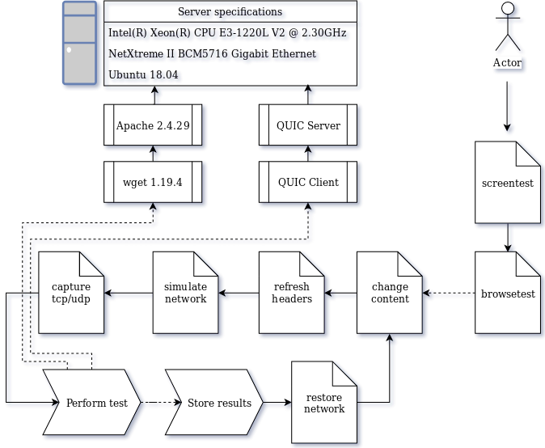

# QUICPerformanceTests
Automating scripts to perform QUIC performance tests. Tied to Chromium's open-source QUIC client and server and wget. Tested on Ubuntu 18.04.

Required to run this out of the box:
- Unix-like OS such as Ubuntu 18.04
- wget service
- Python 3.6 or higher

To start the pipeline, type "python3 browsetest.py". Be sure to edit the script's head to your needs, as is commented in the files.
